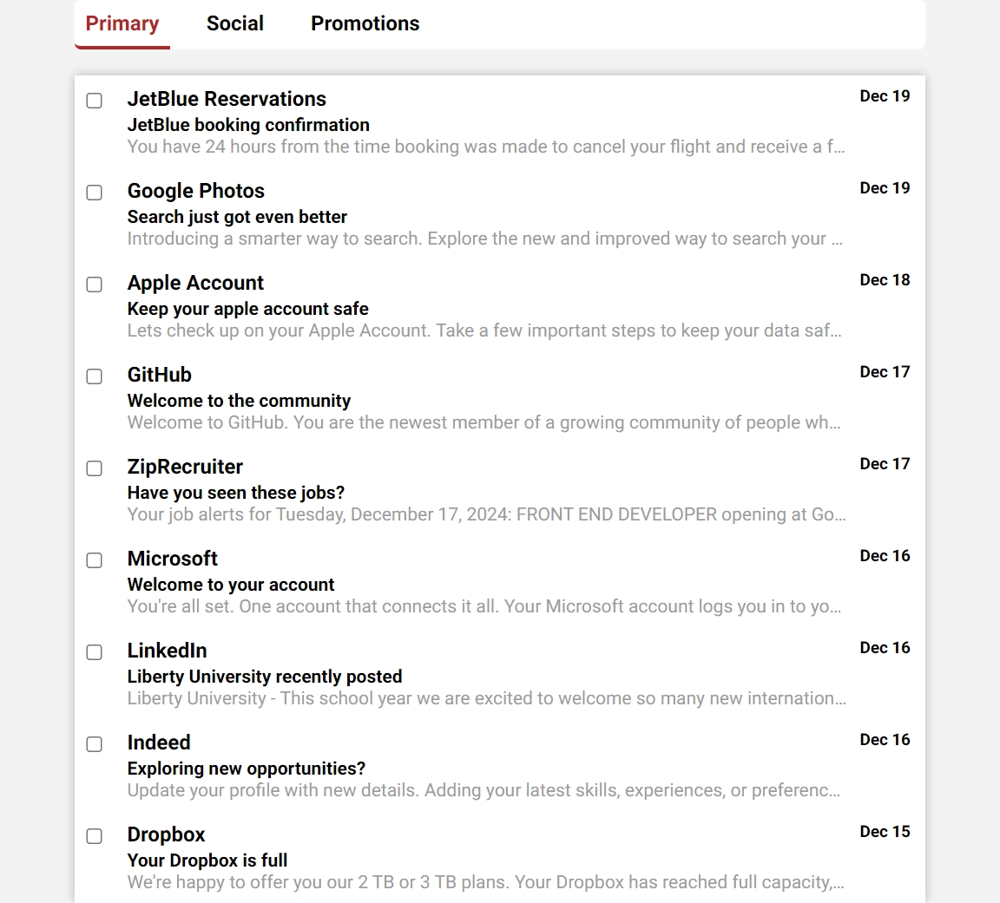

# Inbox Layout with Multiple Checkbox Selection

A modern and responsive inbox layout that mimics Gmail-like functionality, allowing users to check multiple checkboxes with a "Shift-click" feature. This project demonstrates a clean, minimalist design that is fully responsive and features smooth interactions for managing multiple email items at once.

## Description

This project creates an interactive email inbox with a series of email items. Each email is represented by a section containing a checkbox, sender, subject, and message preview. Users can select multiple checkboxes simultaneously by holding down the "Shift" key and clicking on different checkboxes, making it easy to manage multiple emails at once. The layout uses Flexbox for responsiveness, and media queries adjust the grid to fit various screen sizes.

The project includes:

- **Multiple Checkbox Selection**: Users can select multiple checkboxes by holding down the "Shift" key.
- **Responsive Layout**: The design adapts to various screen sizes using Flexbox and media queries.
- **Smooth Transitions**: Subtle hover effects and layout adjustments for a polished user experience.

## Features

- Gmail-like inbox design with a series of email sections.
- Multiple checkbox selection with "Shift-click" functionality.
- Responsive design using Flexbox for a modern, clean layout.
- Subtle hover and focus effects for a more interactive experience.
- Media queries for optimal display across different screen sizes (mobile, tablet, desktop).
- Google Fonts integration for a modern font style (Roboto).

## Technologies Used

- HTML
- CSS
- JavaScript

## How to Run

1. Clone the repository to your local machine.
2. Open `index.html` in your web browser.
3. Alternatively, you can view the live project on GitHub Pages: [Multiple Checkboxes on GitHub Pages](https://deannamandarino.github.io/multiple-checkboxes/).

## Acknowledgments

This project was completed as part of the JavaScript30 course. Special thanks to Wes Bos for the excellent resources and guidance throughout the course.